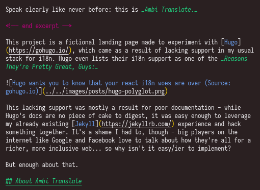

A theme for Visual Studio Code.

<!-- end excerpt -->

F was created to make editing Markdown files a total breeze again - Markdown is easy to read and so it should be as easy to write as possible.

I spend a lot of time with Markdown, and the default themes that come with Visual Studio Code just don't give me the sort of contrast I need when it comes to editing lines and lines and lines of the stuff for hours at a time.

You can [download F here](https://marketplace.visualstudio.com/items?itemName=k4y4k.f).
