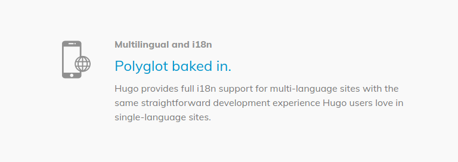

Speak clearly like never before: this is _Ambi Translate._

<!-- end excerpt -->

This project is a fictional landing page made to experiment with [Hugo](https://gohugo.io/), which came as a result of lacking support in my usual stack for i18n. Hugo even lists their i18n support as one of the _Reasons They're Pretty Great, Guys:_

This lacking support was mostly a result for poor documentation - while Hugo's docs are no piece of cake to digest, it was easy enough to leverage my already existing [Jekyll](https://jekyllrb.com/) experience and hack something together. It's a shame I had to, though - big players on the internet like Google and Facebook love to talk about how they're all for a richer, more inclusive web... so why isn't it easy/ier to implement?

But enough about that.

## About Ambi Translate

_Ambi Translate_ is a fictional translation service offered by fictional Google-like demigod-corporation _Ambi._ The service entered widespread use ~~because Ambi practically owns its users~~ because of the unusual habit Ambi have of assigning mascots to its services. These mascots appear in most (if not all) of Ambi's products, assuming different names and titles as they see fit.

Ambi styles their translation service as something groundbreaking - a literal revolution in the way the world communicates - and so they posit that these two are the _Harbringers of the Revolution,_ paving the way for a new world.

This overdramtic, slightly hammy rhetoric soon earned Ambi new fans, and so Ambi Translate remains well-liked and depended upon to this day.

## What I Used

Translations from English to 'Nimish' were generated with my `nimify` package ([available on npm](https://www.npmjs.com/package/nimify)) and manually copied into a Hugo `config.toml` file.

The single-page layout makes heavy use of [Bulma](https://bulma.io), and the playing of the sample voice clips is handled with [Howler.js](https://www.npmjs.com/package/howler). The sample voice clips were generated with the use of [MaryTTS](http://mary.dfki.de/) and [typetalk](https://aur.archlinux.org/packages/typetalk/).

All in all, I learned a lot!
