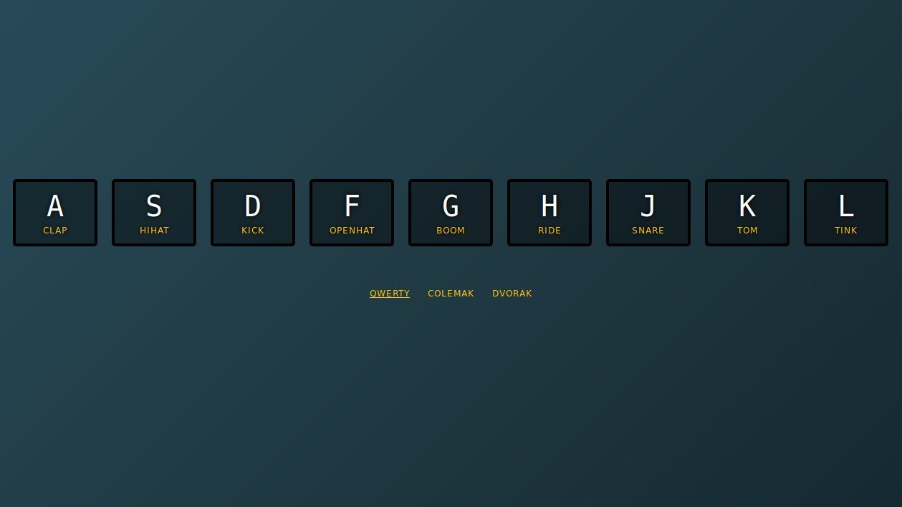

A drum kit you can play with your keyboard!

<!-- end excerpt -->

Wes Bos' [#JavaScript30](https://javascript30.com/) is a pretty popular challenge, and this is the first exercise he takes you through. I decided that, considering I don't use QWERTY (if I can help it) all that often, I'd try and extend it to other keyboard layouts.

I thought about implementing other languages and their respective layouts too - like QWERTZ for German, or AZERTY for French - but then decided that I'd keep it small and simple.