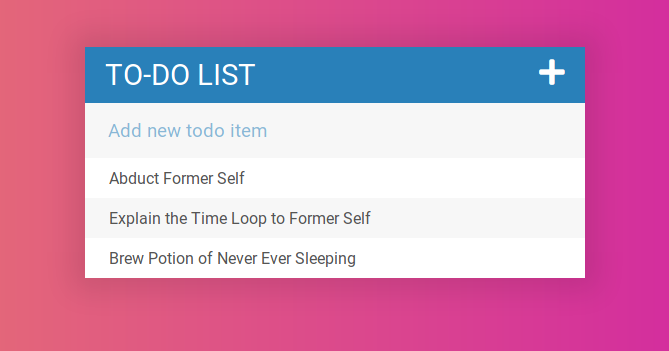

A simple to-do app.

<!-- end excerpt -->

To-do apps are like "hello world" for big boys and girls, right? Or, failing that, a Turing test? 😄

This was made as an exercise for [an online class](https://www.udemy.com/the-web-developer-bootcamp/).
